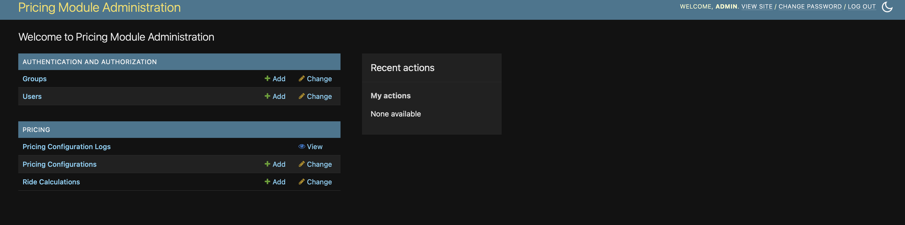
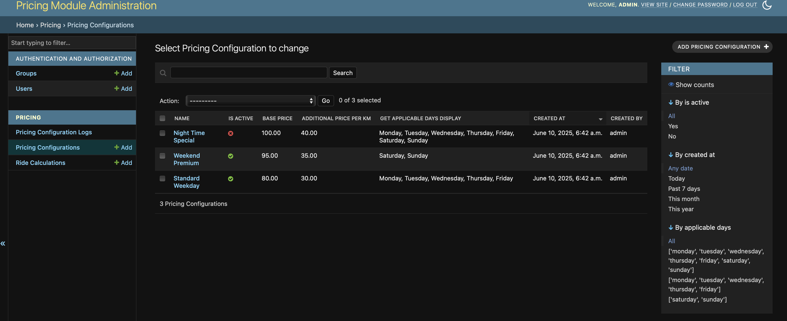

# Pricing Module

Django web application with configurable pricing module for ride services like Uber/Ola.

## 📸 Screenshots

### Django Admin Interface

*Main admin interface showing pricing configurations and audit logs*

### Pricing Configuration Management

*Add/Edit pricing configuration with comprehensive validation*

### API Documentation

*Complete REST API documentation with examples*

### Price Calculation Response

*Live API response showing price breakdown*

## 🏗️ Features

- **Configurable Pricing**: Multiple pricing configurations with day-based rules
- **Django Admin**: Full management interface with audit logging
- **REST API**: Calculate pricing dynamically with detailed breakdown
- **Formula**: `Price = (DBP + (Dn × DAP)) + (Tn × TMF) + WC`
- **Testing**: 17 comprehensive test cases (all passing)

## 🚀 Quick Start

```bash
# Clone and setup
git clone https://github.com/amukta14/Pricing-Module.git
cd Pricing-Module
./setup.sh

# Start server
source ../pricing_env/bin/activate
python manage.py runserver
```

**Access Points:**
- Admin: http://127.0.0.1:8000/admin/ (admin/admin123)
- API Docs: http://127.0.0.1:8000/api/docs/
- Health: http://127.0.0.1:8000/api/health/

## 📡 API Endpoints

### Calculate Price
**POST** `/api/calculate-price/`
```json
{
    "distance_km": 5.5,
    "time_hours": 1.5,
    "waiting_minutes": 10,
    "day_of_week": "monday"
}
```

### Get Configurations  
**GET** `/api/pricing-configurations/`

### Health Check
**GET** `/api/health/`

### Documentation
**GET** `/api/docs/`

## 🔧 Technical Details

**Architecture:**
- Models: PricingConfiguration, PricingConfigurationLog, RideCalculation
- Service Layer: PricingCalculationService for business logic
- API: Django REST Framework with comprehensive validation
- Admin: Enhanced interface with audit logging

**Formula Components:**
- **DBP**: Distance Base Price (80 INR for first 3KM)
- **DAP**: Distance Additional Price (30 INR/KM after base)
- **TMF**: Time Multiplier Factor (1x, 1.25x, 1.5x based on hours)
- **WC**: Waiting Charges (5 INR per 3-minute interval)

## 🧪 Testing

```bash
python manage.py test  # 17 tests (all passing)
```

## 🏗️ Project Structure

```
pricing_module/
├── pricing/           # Main app
├── manage.py         # Django CLI
├── requirements.txt  # Dependencies  
├── setup.sh         # One-command setup
└── README.md        # This file
``` 